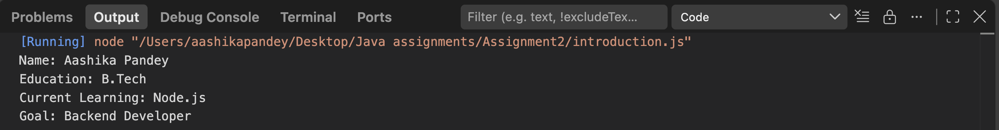

# NodeJS-Basics-Assignment

## Assignment Description

This assignment demonstrates a basic Node.js application and a simple introduction program using JavaScript and console.log().

## Project Structure

NodeJS-Basics-Assignment/
│
├── app.js
├── introduction.js
└── README.md

## Steps to Run

1. Install Node.js.
2. Open the project folder in the terminal.
3. Run the first program using:

node app.js

4. Run the introduction program using:

node introduction.js

## Commands Used

node app.js

node introduction.js

## Expected Output

### app.js

Hello, Node.js!
I am learning backend development

### introduction.js

Name: Your Name
Education: B.Tech
Current Learning: Node.js
Goal: Backend Developer

## Screenshots

