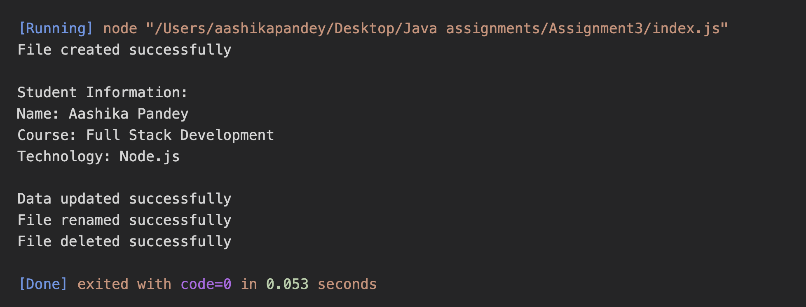

# Assignment 3 - Node.js File System

## Student Information

Name: Aashika Pandey

## Assignment Description

This assignment demonstrates file handling in Node.js using the fs module.

The program performs the following operations:

1. Creates a student.txt file using fs.writeFile().
2. Reads the file using fs.readFile().
3. Updates the file using fs.appendFile().
4. Renames the file using fs.rename().
5. Deletes the file using fs.unlink().

## Project Structure

Assignment-3/
│
├── index.js
├── student.txt
├── package.json
└── README.md

## How to Run

Open the project folder in the terminal.

Run the following command:

node index.js

Or:

npm start

## Operations Performed

### 1. File Creation

The program creates student.txt and stores:

Name: Aashika Pandey
Course: Full Stack Development
Technology: Node.js

### 2. Reading File

The program reads student.txt and displays its complete content in the terminal.

### 3. Updating File

The program adds:

Experience: 1 Year
City: Kolkata

The existing content is not removed.

### 4. Renaming File

The file is renamed from:

student.txt

to:

studentDetails.txt

### 5. Removing File

After all operations are completed, studentDetails.txt is deleted.

## Expected Terminal Output

File created successfully

Student Information:
Name: Aashika Pandey
Course: Full Stack Development
Technology: Node.js

Data updated successfully
File renamed successfully
File deleted successfully

## Screenshots

